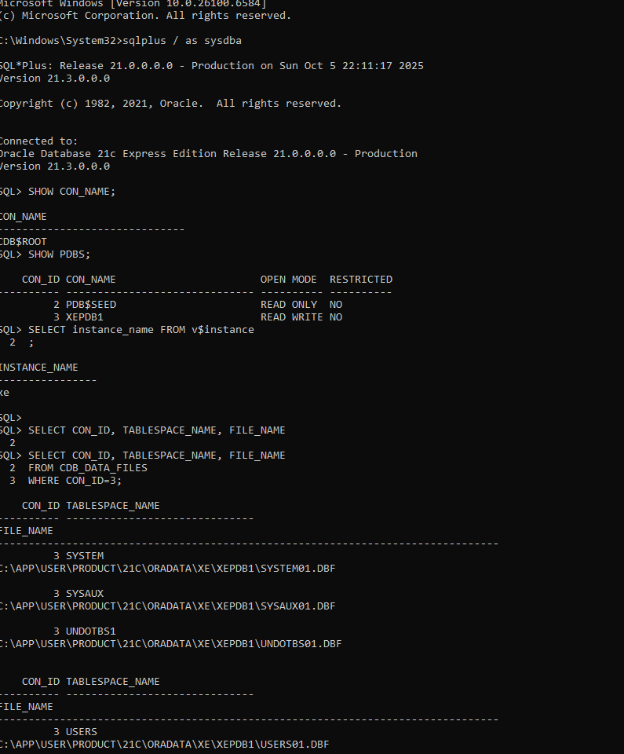
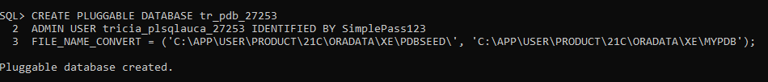
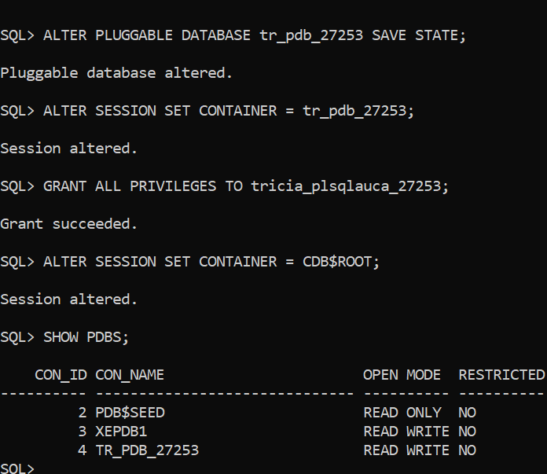
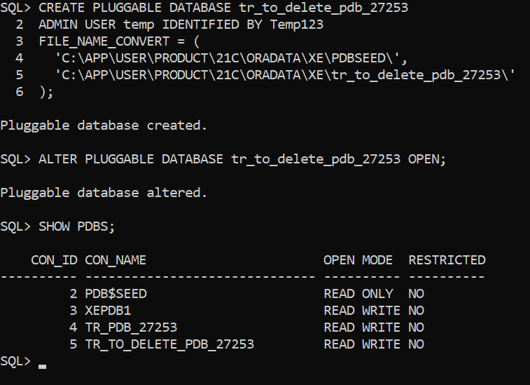
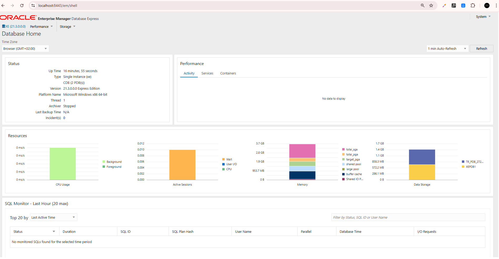
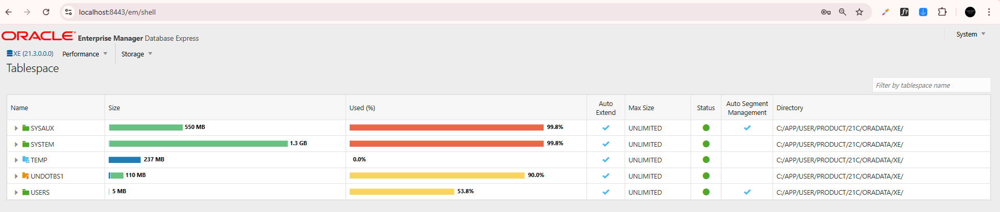

# Oracle Database Assignment II - PDB Management & OEM Configuration

## Report Summary

This repository contains the completed assignment: a permanent PDB (TR_PDB_27253) created and left open for coursework, a temporary PDB created and dropped to demonstrate lifecycle management, and Oracle Enterprise Manager configured and verified via dashboard screenshots.

## Student Information

- **Name:** Tricia Nshuti
- **Student ID:** 27253
- **Course:** INSY 8311 - Database Development with PL/SQL
- **Instructor:** Eric Maniraguha
- **Submission Date:** October 6, 2025

---

## Assignment Overview

This assignment demonstrates proficiency in Oracle 21c Multi-tenant Architecture by:

1. Creating a permanent Pluggable Database (PDB) for coursework
2. Demonstrating PDB lifecycle management through creation and deletion
3. Configuring and accessing Oracle Enterprise Manager (OEM)

---

## Repository Contents

tricia_nshuti_pdb_27253/
├── README.md
└── Screenshots/
├── 01_database_connection.png
├── 02_pdb_creation.png
├── 03_pdb_open.png
├── 04_show_pdbs.png
├── 05_delete_pdb_creation.png
├── 06_pdb_deleted.png
├── 07_oem_configure.png
├── 08_oem_dashboard.png
└── 09_oem_tablespaces.png

---

## Task 1: Main PDB Creation

**Objective:** Create a permanent pluggable database for storing coursework.

**PDB Details:**

- PDB Name: `tr_pdb_27253`
- Admin User: `tricia_plsqlauca_27253`
- Status: READ WRITE (Auto-open enabled)

### Task 1 Evidence


_Connected as SYSDBA_


_PDB creation command and success_


_PDB opened and state saved_


_Verification showing PDB in READ WRITE mode_

---

## Task 2: PDB Lifecycle Management

**Objective:** Demonstrate PDB creation and deletion process.

**Temporary PDB Details:**

- PDB Name: `tr_to_delete_pdb_27253`
- Lifecycle: Created → Opened → Closed → Dropped with datafiles

### Task 2 Evidence


_Temporary PDB created_


_PDB permanently deleted and verified_

---

## Task 3: Oracle Enterprise Manager

**Objective:** Configure and access OEM for database management.

**Configuration:**

- HTTP Port: 8080
- HTTPS Port: 8443
- Access URL: https://localhost:8443/em

### Task 3 Evidence


_Port configuration_


_Dashboard with username visible_


_Resource monitoring view_

---

## Key SQL Commands

### Task 1 - Main PDB

```sql
CREATE PLUGGABLE DATABASE TR_PDB_27253
ADMIN USER tricia_plsqlauca_27253 IDENTIFIED BY ****
FILE_NAME_CONVERT = ('pdbseed', 'TR_PDB_27253');

ALTER PLUGGABLE DATABASE TR_PDB_27253 OPEN;
ALTER PLUGGABLE DATABASE TR_PDB_27253 SAVE STATE;
```

### Task 2 - Temporary PDB

```sql
CREATE PLUGGABLE DATABASE TR_TO_DELETE_PDB_27253
ADMIN USER temp IDENTIFIED BY ****
FILE_NAME_CONVERT = ('pdbseed', 'TR_TO_DELETE_PDB_27253');

ALTER PLUGGABLE DATABASE TR_TO_DELETE_PDB_27253 CLOSE IMMEDIATE;
DROP PLUGGABLE DATABASE TR_TO_DELETE_PDB_27253 INCLUDING DATAFILES;
```

### Task 3 - OEM Configuration

```sql
BEGIN
	DBMS_XDB_CONFIG.SETHTTPPORT(8080);
	DBMS_XDB_CONFIG.SETHTTPSPORT(8443);
END;
/

SHUTDOWN IMMEDIATE;
STARTUP;
```

## Environment Details

- Oracle Version: 21c Express Edition
- CDB Name: ORACLE21CDB
- Platform: Windows

## Challenges and Solutions

- **Challenge:** ORA-65019 error when attempting to open already-open PDB
- **Solution:** Verified PDB status before executing OPEN command

## Verification Steps

```sql
-- Check PDB exists
SHOW PDBS;

-- Verify user created
ALTER SESSION SET CONTAINER = TR_PDB_27253;
SELECT username FROM dba_users WHERE username LIKE '%PLSQLAUCA%';
```

## Lessons Learned

I learned practical steps for PDB lifecycle management: use FILE_NAME_CONVERT when creating from the seed, verify PDB status before issuing OPEN to avoid ORA-65019, and SAVE STATE to persist the desired open state. Configuring OEM via DBMS_XDB_CONFIG provides quick monitoring and made troubleshooting much easier during this assignment.

## References

- Oracle Database 21c Documentation
- Course Lecture: "Introduction to PL/SQL"
- Course Lecture: "Oracle Database Environment (CDBs & PDBs) & OEM"
